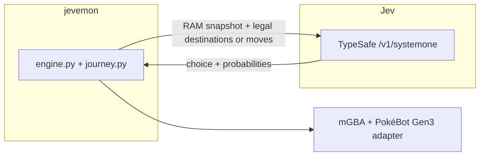

# How this is wired

One host, one decision loop. `jevemon` builds a state object out of FireRed's RAM, asks Jev a single typed question, and only then presses a button.

Jev never sees pixels. The UI's live frame is for you.

## A leg of the journey

1. `journey.py` reads the current map and works out every destination reachable from here — a door, a route connection, a Pokémon Center if the party needs healing — using the PokéBot Gen3 adapter's pathfinder to discard anything that isn't actually reachable.
2. It packs a state object: current location, party HP, legs taken, and every candidate destination with how many times it's already been visited.
3. One HTTP call, model `jev-1.13.0`, a [`choice`](https://docs.typesafe.ai/primitives/choice.md) question. A leg with only one legal destination skips the call entirely.
4. The answer has to name a real destination, come with a full probability distribution, and a confidence in `[0, 1]`. Anything else ends the run — there's no fallback that picks for Jev.
5. `journey.py` walks there. If a wild encounter interrupts the walk, `strategy.py`'s `JevStrategy` resolves the battle turn by turn (same shape of typed decision, applied to moves and switches instead of destinations), then the journey re-plans from wherever the encounter left the player.

The baseline agent skips the API call and takes the first unvisited destination, or the strongest-looking damage roll in a battle. Useful for offline checks. Boring to watch.

## Package layout

- `jevemon/paths.py` — shared paths and `.env` loading.
- `jevemon/config.py` — validates `config.json`: agent, speed, decision/leg/stuck limits, and the party.
- `jevemon/decisions.py` — the single `ask_jev` call shared by journey legs and battle turns.
- `jevemon/strategy.py` — battle-turn resolution (`JevStrategy`) used only for wild-encounter interruptions.
- `jevemon/journey.py` — `Destination` and `Journey`: candidate destinations, the decision, and the walk itself.
- `jevemon/engine.py` — boots the ROM under mGBA and builds the Pallet Town checkpoint.
- `jevemon/runner.py` — `Session`: recording, pause/stop, and the run loop.
- `jevemon/server.py` — the loopback UI/API server.
- `jevemon/ui/index.html` — the UI itself (static HTML + vanilla JS, no build step).

ROM: FireRed USA v1.1 only, filename `Pokemon - Fire Red Version (U) (V1.1).gba`. `scripts/setup.py` pins the vendored [PokéBot Gen3](https://github.com/40Cakes/pokebot-gen3) adapter (see [NOTICE.md](NOTICE.md)) at a fixed revision and installs [libmgba-py 0.2.0](https://github.com/hanzi/libmgba-py) for macOS arm64. `--prepare` loads a fresh-game checkpoint from PokéBot's own test fixtures and writes `data/journey.state`; every run reloads that checkpoint and writes your configured party into RAM.

Switches wait for a stable party menu, then match `personality_value`. See `AGENTS.md`. Old slot numbers from before the menu opened are wrong.

The UI server binds to `127.0.0.1:8765`. It serves the live frame, the last request/response (key stripped), and replay MP4s. It does not serve the ROM.

## Where to change things

| Want | Touch |
| --- | --- |
| A different starting party | `config.json` or the UI |
| A different journey question | the `instructions` string in `Journey.decide` (`jevemon/journey.py`) |
| A different battle question | the `instructions` string in `JevStrategy.choose` (`jevemon/strategy.py`) |
| Stricter config validation | `validate_config` in `jevemon/config.py` |
| A new finish condition | `Session.play_journey` in `jevemon/runner.py` |
| Headless run | `uv run python -m jevemon --run --speed 4` |
