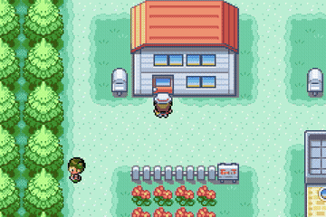

# JevEmon

Jev walks a real Pokémon FireRed ROM.

Not a screenshot agent. Not a bot that mashes A. Each leg of the walk, the code reads the overworld out of RAM, works out every place you could actually go from here — a door, a path to the next route, a Pokémon Center if your party needs one — and hands that list to [Jev](https://docs.typesafe.ai/models.md). Jev picks a destination; the code paths there and presses the buttons. If a wild Pokémon interrupts the walk, Jev fights it out with the same kind of typed decision, then the journey re-plans from wherever the encounter left you.

More on how this is wired: [ARCHITECTURE.md](ARCHITECTURE.md)

<p align="center"></p>

## Status

Verified milestones so far: Jev can leave the Player's House, cross Pallet Town, deliver itself through Route 1 (fighting and winning any wild encounters along the way), and reach Viridian City. Further legs of the journey (Oak's Parcel, the first Gym) aren't built yet — the walk currently ends the run once it reaches Viridian City.

## Try it

Grab a [TypeSafe API key](https://typesafe.ai) and put it in `.env`.

```sh
cp .env.example .env
```

Drop `Pokemon - Fire Red Version (U) (V1.1).gba` next to this README. Requires a Mac with Apple Silicon.

```sh
brew install mgba ffmpeg uv
uv run python scripts/setup.py
uv run python -m jevemon --prepare
uv run python -m jevemon
```

That builds the checkpoint, starts the local server, and opens [http://127.0.0.1:8765](http://127.0.0.1:8765) for you. Hit Go live and sit with it. Edit the lineup in the page. Speed it up. Scrub the VOD after. Everything runs through `uv` — no shell wrapper scripts, no separate install step.

One walk, no browser:

```sh
uv run python -m jevemon --run --speed 4
```

Other useful commands:

```sh
uv sync                                    # just the Python environment
uv run python -m jevemon --check-journey   # offline, no API calls
uv run python -m jevemon --port 9000       # serve on a different port
```

## What Jev sees

Not the screen.

A JSON snapshot of the overworld: where you are, your party's HP, and every destination the pathfinder already confirmed is reachable from here — each with how many times you've already visited it. During a wild encounter, the snapshot switches to the same battle state as any other fight: HP, types, moves, stats, abilities, PP, and only the legal moves and switches for that turn.

Jev answers with one choice and a probability for every option offered. If the answer is illegal, the run stops. There is no backup brain.

On the ROM, a switch is the Pokémon's personality value, not "slot 3." The party menu moves around. Using the old slot would send out the wrong one. That note lives in [AGENTS.md](AGENTS.md).

Edit the starting lineup in `config.json` or the UI.

## This is a demo

The interesting part isn't the exact team or the exact route. It's that a typed choice over honest game state — no screenshots, no free-text prompting — is already enough to walk an overworld and handle whatever interrupts it.

Fork it. Push the journey further. Teach it a destination beyond Viridian City, or a whole different region.

Third-party dependencies and their licenses are in [NOTICE.md](NOTICE.md).

## License

Copyright © 2026 Daniel Alfasi. Licensed under the GNU General Public License v3.0 — see [LICENSE](LICENSE).
